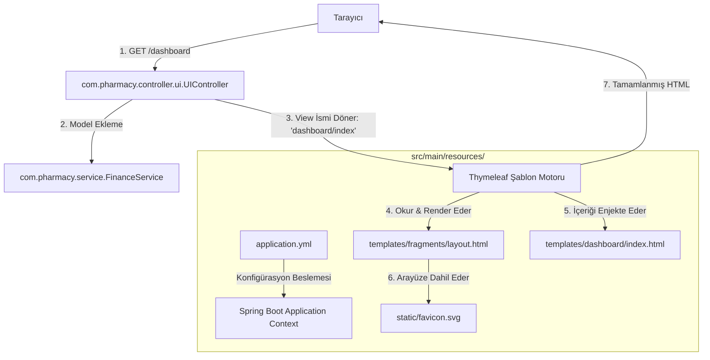

# 📁 RESOURCES (KAYNAKLAR) DİZİNİ REHBERİ

Spring Boot tabanlı Eczane Yönetim Sistemi (Pharmacy Management System) projemizde `src/main/resources` klasörü, uygulamanın **Java dışı tüm statik, dinamik ve konfigürasyonel bileşenlerini** barındıran kritik bir katmandır. 

Bu rehberde, `resources` dizininin ne işe yaradığı, alt klasörlerinin rolleri ve her bir dosyanın üstlendiği görevler detaylıca açıklanmıştır.

---

## 1. `resources` Dizini Nedir ve Ne İşe Yarar?

Maven proje standartlarında `src/main/resources`, uygulamanın **Classpath** (sınıf yolu) sınırları içine dahil edilecek olan statik kaynakların yönetildiği yerdir. Proje derlendiğinde (build edildiğinde), bu dizindeki tüm dosyalar Java sınıflarıyla birlikte paketlenerek (JAR dosyasının içine) sunucuya dağıtılır.

Spring Boot mimarisinde bu dizin temel olarak **üç ana gruba** ayrılır:
1. **Konfigürasyon Katmanı (`application.yml`):** Uygulamanın veritabanı bağlantısı, Hibernate DDL davranışı ve diğer çevresel ayarlarının yönetildiği merkezdir.
2. **Statik Varlıklar Dizini (`static/`):** Sunucu tarafında hiçbir işleme (render) uğramadan doğrudan tarayıcıya (istemciye) gönderilen ham varlıklardır (CSS, Javascript, görseller, favicon vb.).
3. **Dinamik Şablonlar Katmanı (`templates/`):** MVC (Model-View-Controller) desenindeki **View (Görünüm)** katmanıdır. Thymeleaf şablon motoru, bu klasördeki HTML dosyalarını okur, Controller'dan gelen verilerle birleştirip (server-side rendering) dinamik HTML sayfaları üreterek tarayıcıya gönderir.

---

## 2. DOSYA VE DIZIN BAZLI DETAYLI ANALİZ

### ⚙️ Konfigürasyon Dosyaları

#### 📄 [application.yml](file:///c:/Users/iremy/Desktop/Java%20Final%20Projesi/src/main/resources/application.yml)
* **Görevi:** Eczane Yönetim Sistemi'nin kalbidir. Uygulamanın çalışması için gereken tüm sistem parametrelerini barındırır.
* **İçeriği ve İşlevi:**
  * **Veritabanı Ayarları (`spring.datasource`):** Uygulamanın `localhost:3306` portunda çalışan `pharmacy_db` MySQL veritabanına `root`/`root` kimlik bilgileriyle SSL kullanmadan bağlanmasını sağlar.
  * **JPA/Hibernate Ayarları (`spring.jpa`):** 
    * `ddl-auto: update` özelliği sayesinde entity sınıflarımızda yapılan değişiklikleri (örneğin `@Version` alanının eklenmesini) veritabanına otomatik yansıtır.
    * `show-sql: true` özelliğiyle Hibernate tarafından arka planda çalıştırılan tüm SQL sorgularını IntelliJ konsoluna yazdırarak hata ayıklamayı kolaylaştırır.
    * `MySQL8Dialect` belirterek MySQL 8.x sürümüne en uygun optimize SQL komutlarının üretilmesini sağlar.

---

### 🎨 Statik Klasör (`static/`)

#### 📄 [favicon.svg](file:///c:/Users/iremy/Desktop/Java%20Final%20Projesi/src/main/resources/static/favicon.svg)
* **Görevi:** Web uygulamasının tarayıcı sekmesinde görünen küçük simgedir (favicon).
* **İşlevi:** Uygulamanın kurumsal kimliğini tamamlayan vektörel (SVG) görseldir. `SecurityConfig` içinde `/favicon.*` formatında doğrulamadan muaf tutulmuştur ki kullanıcı giriş yapmadan önce bile tarayıcı sekmelerinde simge temiz bir şekilde yüklenebilsin.

---

### 🌐 Dinamik Şablonlar Klasörü (`templates/`)

Bu klasördeki tüm HTML sayfaları **Thymeleaf** şablon diliyle donatılmıştır. Sayfalar, `fragments/layout.html` şablonunu miras alarak (decorating) kod tekrarını önler ve modern bir kullanıcı arayüzü sunar.

#### 📁 `fragments/` (Ortak Arayüz Parçaları)
* **[layout.html](file:///c:/Users/iremy/Desktop/Java%20Final%20Projesi/src/main/resources/templates/fragments/layout.html):** Projenin ana iskeletidir. CSS ve Javascript kütüphanelerinin (Tailwind, Bootstrap, Vanilla JS) yüklendiği, tüm modüllerin içine yerleştiği ortak düzen şablonudur. Spring Security rol tanımlarına göre (ADMIN, PHARMACIST, CASHIER) kenar menü (sidebar) linklerini dinamik olarak gösterir veya gizler.

#### 📁 `dashboard/` (Yönetim Paneli)
* **[index.html](file:///c:/Users/iremy/Desktop/Java%20Final%20Projesi/src/main/resources/templates/dashboard/index.html):** Eczacıyı karşılayan modern **Bento Box Dashboard** ekranıdır. Bugünkü Ciro, Bugünkü Kâr, Kritik Son Kullanma Tarihli İlaçlar ve Düşük Stok Alarmları gibi kritik verileri, arka planda çalışan REST API'lerden (`/api/dashboard/stats`) AJAX yardımıyla dinamik olarak çekip anlık kartlar halinde gösterir.

#### 📁 `pos/` (Satış Noktası ve Kasa)
* **[index.html](file:///c:/Users/iremy/Desktop/Java%20Final%20Projesi/src/main/resources/templates/pos/index.html):** Kasiyerlerin kullandığı POS/Satış ekranıdır. 
  * *Sol Panel:* İlaçların barkodla veya isimle aranabileceği dinamik AJAX arama motorunu içerir.
  * *Sağ Panel:* Sepete eklenen ilaçların, miktarlarının, reçete türü kontrollerinin ve toplam tutarların tarayıcı belleğinde (stateless Vanilla JS) tutulduğu interaktif sepet arayüzüdür. Ödeme tamamlandığında sepeti JSON olarak REST API'ye (`POST /api/sales`) gönderir.
* **[sale.html](file:///c:/Users/iremy/Desktop/Java%20Final%20Projesi/src/main/resources/templates/pos/sale.html):** Satış geçmişinin listelendiği, fatura detaylarının arayüzde incelendiği yardımcı şablondur.

#### 📁 `inventory/` (Envanter Yönetimi)
* **[list.html](file:///c:/Users/iremy%20Desktop/Java%20Final%20Projesi/src/main/resources/templates/inventory/list.html):** Envanterin akordeon (Accordion) tasarım şablonudur. Tabloda her ilaç tek bir satırda toplam stoğuyla görünür. Satıra tıklandığında altından açılan akordeon menüde, o ilaca ait tüm bağımsız **stok partileri (Purchase batches)** son kullanma tarihleri ve alış fiyatları ile listelenir. Süresi geçen partiler kırmızı, 30 gün kalanlar sarı renkle vurgulanır.
* **[index.html](file:///c:/Users/iremy/Desktop/Java%20Final%20Projesi/src/main/resources/templates/inventory/index.html):** Envanter modülünün ana ayarlarını veya yönlendirmelerini içeren ana şablondur.

#### 📁 `purchase/` (Satın Alma ve Stok Kabul)
* **[index.html](file:///c:/Users/iremy/Desktop/Java%20Final%20Projesi/src/main/resources/templates/purchase/index.html):** Eczaneye giren yeni ilaç partilerinin kaydolduğu ekrandır. Eczacı veya admin buradan barkod okutarak ilacın miktarını, alış fiyatını ve son kullanma tarihini girerek sisteme yeni bir `Purchase` partisi ekler (`POST /api/purchases`).

#### 📁 `customer/` & `customers/` (Müşteri Yönetimi / CRM)
* **`customer/index.html`:** Müşterilerin cari kart detaylarını, geçmiş alışverişlerini ve borç limitlerini gösteren bireysel yönetim şablonudur.
* **`customers/list.html`:** Eczaneye kayıtlı tüm müşterilerin listelendiği, yeni müşterilerin (cari kart) açıldığı arayüzdür. Kasiyer POS ekranında veresiye satış yapmak için bu listedeki kayıtlı müşterileri seçer.

#### 📁 `finance/` (Finansal Defter)
* **[index.html](file:///c:/Users/iremy/Desktop/Java%20Final%20Projesi/src/main/resources/templates/finance/index.html):** Eczanenin gelir-gider tablosudur. Toplam Ciro, Toplam İlaç Maliyeti, Son Kullanma Tarihi Geçtiği İçin İmha Edilen İlaçların Oluşturduğu Toplam Zarar ve Net Kâr verilerini statik ve dinamik stat kartlarında gösterir. Altındaki scrolling ledger (muhasebe defteri) tablosunda tüm alış, satış ve imha hareketleri kronolojik olarak akar.

#### 📁 `settings/` (Kategori ve Marka Ayarları)
* **[index.html](file:///c:/Users/iremy/Desktop/Java%20Final%20Projesi/src/main/resources/templates/settings/index.html):** İlaç kategorileri (Antibiyotik, Ağrı Kesici vb.) ve İlaç Markalarının (Pfizer, Bayer vb.) dinamik olarak yönetildiği admin panelidir. AJAX tabanlı ekleme ve yumuşak silme (soft-delete) işlemleri bu ekrandan tetiklenir.

#### 📁 `login/` (Giriş Ekranı)
* **[index.html](file:///c:/Users/iremy/Desktop/Java%20Final%20Projesi/src/main/resources/templates/login/index.html):** Kullanıcıyı karşılayan güvenli giriş kapısıdır. Spring Security'nin `/api/auth/login` işleme mekanizmasıyla entegre edilmiştir. Tailwind tabanlı şık bir arka plan gradyanı ve modern rounded giriş formlarına sahiptir.

#### 📁 `account/` (Profilim Ekranı)
* **[index.html](file:///c:/Users/iremy/Desktop/Java%20Final%20Projesi/src/main/resources/templates/account/index.html):** Sisteme giriş yapan personelin kendi bilgilerini (ad, kullanıcı adı, şifre güncelleme vb.) görüntüleyip yönetebildiği kişisel arayüzdür.

---

## 3. RESOURCES KATMANININ SİSTEM MİMARİSİNDEKİ ROLÜ

Aşağıdaki şema, `resources` altındaki şablonların ve konfigürasyonun, Java servis katmanıyla nasıl bir bütün halinde çalıştığını özetlemektedir:

Bu modüler kaynak yönetimi sayesinde, arayüzde (HTML/CSS) yapılacak hiçbir değişiklik Java kodlarının yeniden derlenmesini gerektirmez; `application.yml` üzerindeki veritabanı şifre güncellemeleri ise kodun içine dokunulmadan sistemi dakikalar içinde ayağa kaldırmamıza olanak tanır.
